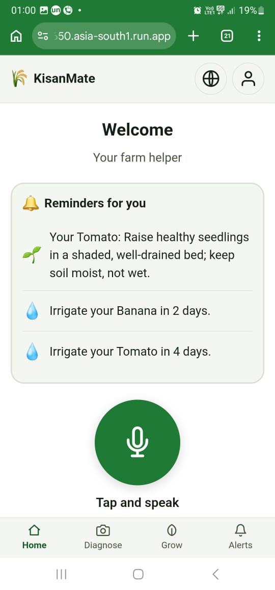
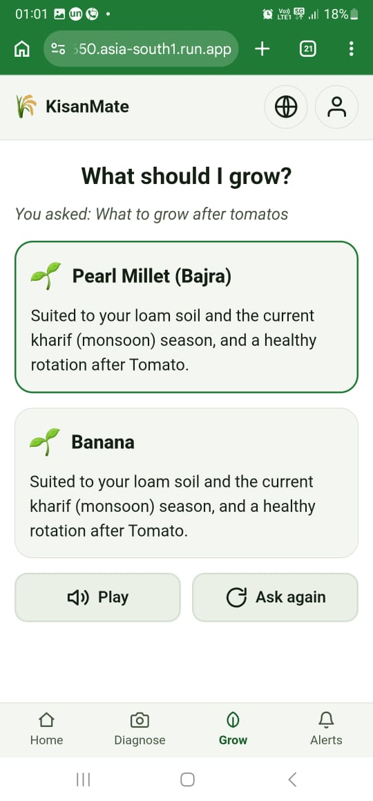
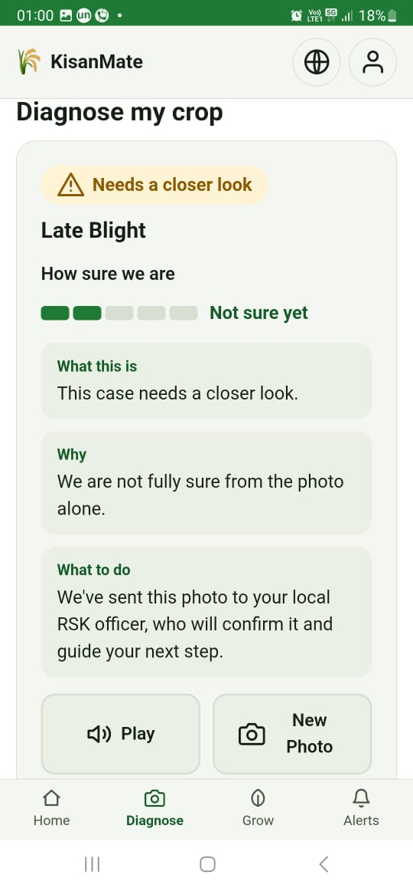
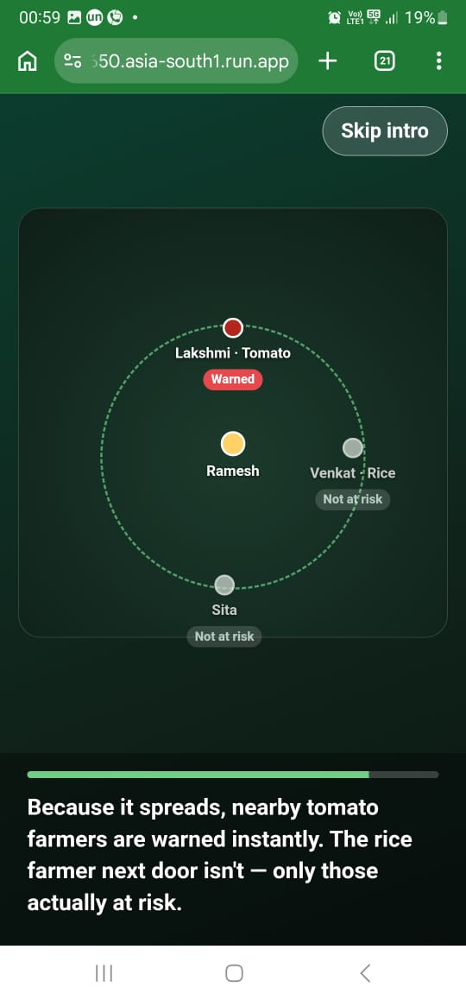
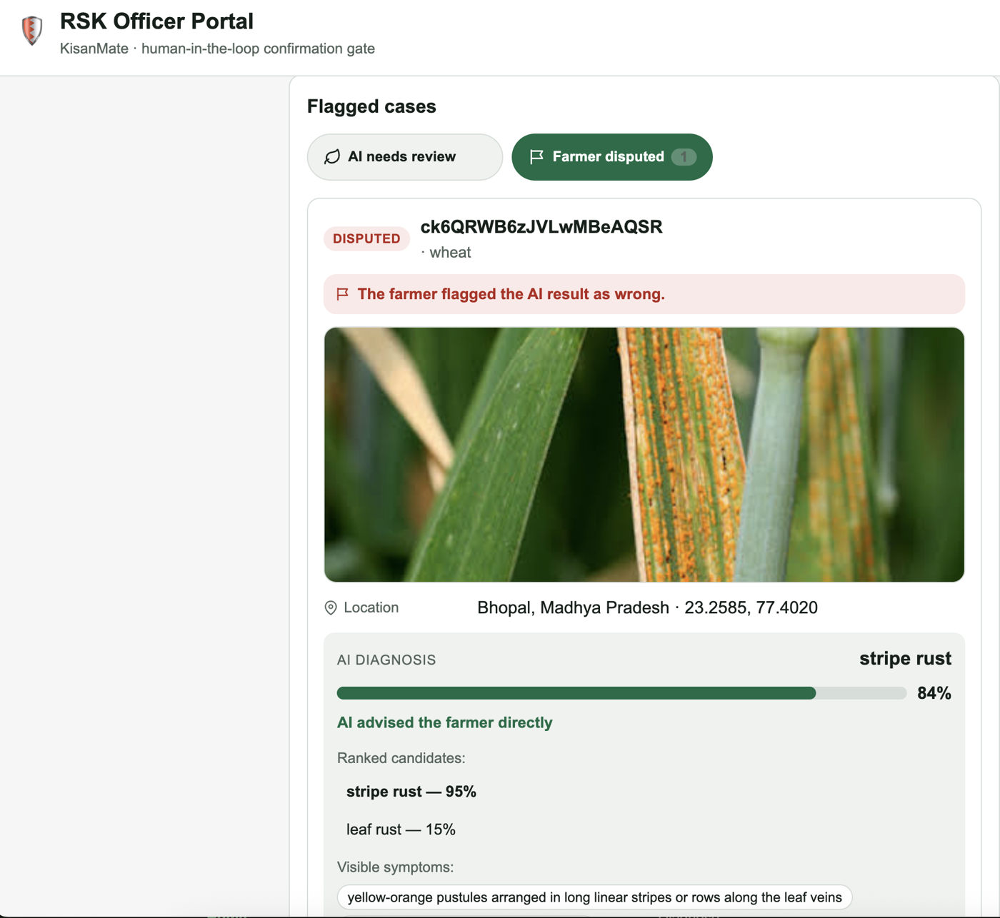
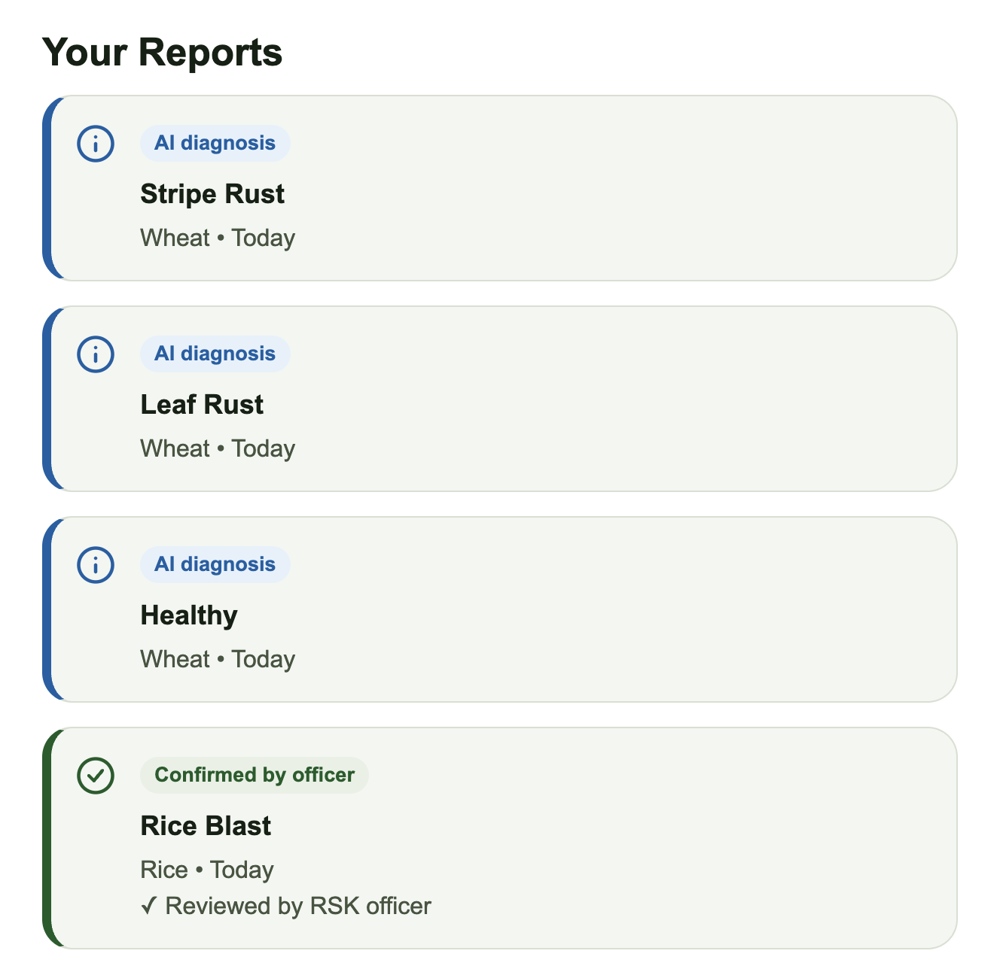
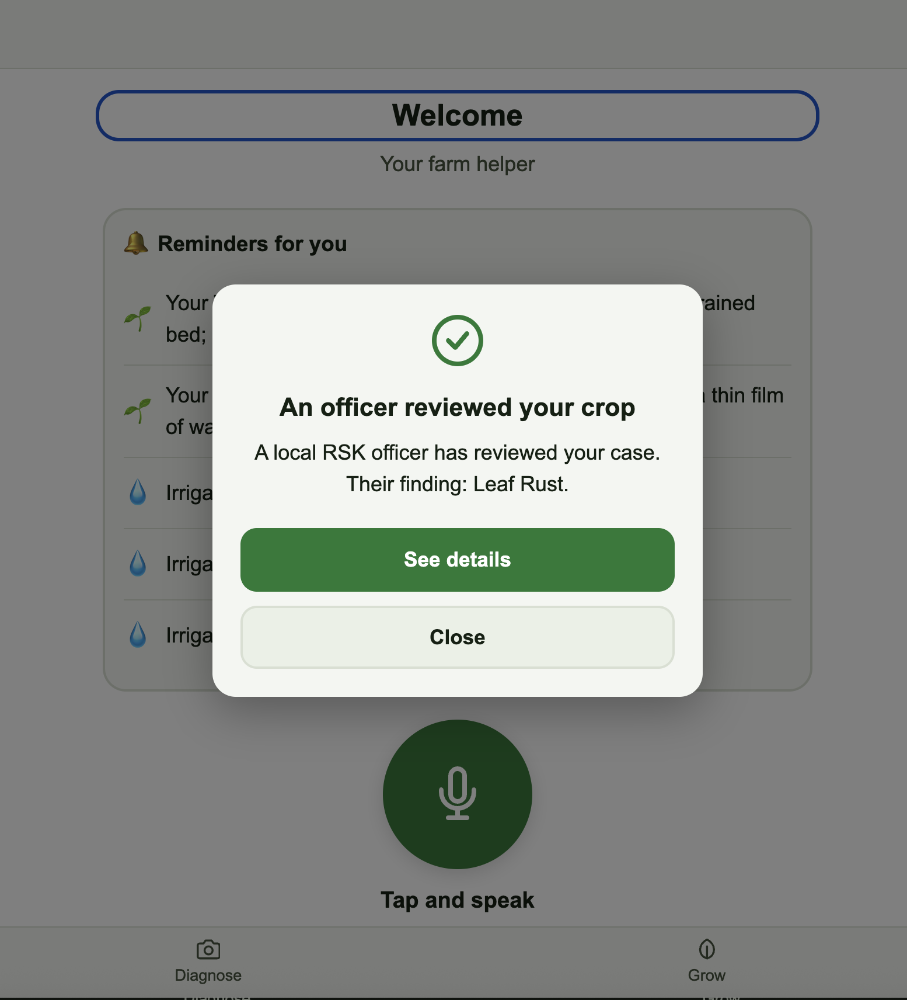

# 🌾 KisanMate

A **voice-first crop-health assistant for small & marginal farmers in India**, in **English, Hindi, and Telugu**. A farmer photographs a sick leaf or asks a spoken question; KisanMate diagnoses it, recommends what to grow, sends proactive care reminders, and — when a contagious disease is confirmed by an agriculture officer — **warns nearby at-risk farmers automatically**.

It runs as **one FastAPI app** that serves both a plain HTML/CSS/JS frontend (no build step) and a JSON API. Database is **Google Firestore**; AI is **Google Gemini** via the `google-genai` SDK.

---

## 📸 Screenshots

### 📱 The farmer app

<table>
  <tr>
    <td align="center" width="25%"><br><sub><b>Home — reminders &amp; voice</b></sub></td>
    <td align="center" width="25%"><br><sub><b>Voice crop recommendation</b></sub></td>
    <td align="center" width="25%"><br><sub><b>Photo diagnosis</b></sub></td>
    <td align="center" width="25%"><br><sub><b>Community disease alert</b></sub></td>
  </tr>
</table>


### 🧑‍🌾 RSK officer portal — the human-in-the-loop gate

<p align="center"></p>

The officer sees the AI's ranked candidates, confidence, and detected symptoms, and works two queues — cases the AI flagged for review, and results a farmer disputed. Their verdict is final and drives what the farmer sees (and any community alert).
<table>
  <tr>
    <td align="center" width="50%"><br><sub><b>Your reports — AI diagnoses vs. officer-confirmed</b></sub></td>
    <td align="center" width="50%"><br><sub><b>Farmer notified when an officer reviews the case</b></sub></td>
  </tr>
</table>
---

## Highlights

- **Voice-first, low-literacy UI** — big mic button, text-to-speech, icons, large tap targets, full en/hi/te translations.
- **Phone + OTP sign-in** (OTP mocked for the demo — the code is shown on screen).
- **Photo diagnosis** — take a live photo or upload; Gemini vision + a deterministic rules engine decide, and a structured *what / why / what-to-do* answer is read aloud.
- **Conversational crop recommendation** — speak a free-form question ("what should I grow after tomatoes?") and get grounded, rotation-aware advice.
- **Proactive reminders** — irrigation/stage-care/harvest reminders computed from planting date + crop cycle, shown on the home screen with no user action.
- **RSK officer portal** (`/admin`) — a separate, denser desk app to confirm/override AI diagnoses; confirming a contagious case fires the community alert.
- **Community alert engine** — anonymized, crop-filtered, distance-based warnings to nearby farmers.
- **Cinematic intro** — an auto-playing scripted story of the whole flow before login.
- **Graceful degradation** — every AI call has a deterministic fallback, so the app stays useful even if Gemini or the network is down (nothing ever shows the farmer a stack trace).

## Architecture 

Four layers: (1) a **deterministic core** (crop scoring, disease-risk prior, fusion math, alert propagation) in plain Python with no AI calls; (2) an **AI content layer** (Gemini) that adds natural-language understanding/explanation on top — it never replaces the core; (3) **silent fallbacks** that degrade to the deterministic layer and log to a telemetry store on any failure; (4) **human override** — the farmer can correct any field, and an RSK officer's verdict is authoritative.

---

## Prerequisites

| Requirement | Notes |
|---|---|
| **Python 3.11+** | Tested on 3.11–3.14. |
| **A Google Cloud project with Firestore** | Firestore in **Native mode**. This is the datastore — the app needs it to run. |
| **`gcloud` CLI** | For local Firestore auth (Application Default Credentials). [Install guide](https://cloud.google.com/sdk/docs/install). |
| **A Gemini API key** | From [Google AI Studio](https://aistudio.google.com/apikey). *Optional to boot* — without a working key the AI degrades to deterministic fallbacks (see [Notes](#notes-on-ai--graceful-degradation)), but live photo diagnosis needs a funded key. |

---

## Quick start (local)

```bash
# 1. Clone
git clone <this-repo-url> kisanmate && cd kisanmate

# 2. Create a virtualenv and install dependencies
python -m venv .venv
source .venv/bin/activate           # Windows: .venv\Scripts\activate
pip install -r requirements.txt

# 3. Point Firestore at your Google Cloud project (Application Default Credentials)
gcloud auth application-default login
gcloud config set project <your-gcp-project-id>
#   ...and make sure Firestore (Native mode) is enabled for that project:
#   https://console.cloud.google.com/firestore

# 4. Configure environment
cp .env.example .env
#   edit .env:  set GEMINI_API_KEY=... and GOOGLE_CLOUD_PROJECT=<your-gcp-project-id>

# 5. Seed the database (idempotent — safe to re-run)
python seed.py          # demo farmers (Ramesh, Lakshmi, Venkat, Sita) with phones
python seed_crops.py    # ~29 crops with diseases, seasons, growth stages

# 6. Run
uvicorn main:app --reload --port 8080

# 7. Open
#   Farmer app:      http://localhost:8080/
#   Officer portal:  http://localhost:8080/admin
#   Telemetry log:   http://localhost:8080/log
```

> **Tip for judges:** the fastest way to see the whole story is the **guided demo** — on the **Welcome screen** tap **"Run demo scenario"** (no sign-in needed; it's also on the Profile page once signed in). It replays recommendation → uncertain diagnosis → officer confirmation → neighbour alert on the seeded data, entirely offline (no AI calls), so it looks identical every time.

---

## Using the app

### Farmer flow (`/`)
1. **Language** → a short **cinematic intro** plays (skippable; plays once) → **login**.
2. **Sign in with phone + OTP.** OTP is **mocked** for the demo: after "Send code" the screen shows **`Demo OTP: XXXX`** — type that to continue. (Any 10-digit number works; a new number creates a new farmer.)
   - To sign in as the seeded demo farmer, use Ramesh's number **`9876500001`**.
3. First-time numbers go through **profile setup** (location via device GPS or a typed place, soil type, current crops + planting dates); returning numbers go straight home.
4. **Home** offers **Diagnose** (photo), **Grow** (voice recommendation), **Alerts**, and proactive **reminders**.

### Officer portal (`/admin`)
- Separate login (not phone/OTP). **Demo credentials are shown on the page** and are:
  - **username:** `officer`  ·  **password:** `rsk2024`
- Two tabs: **AI needs review** (auto-escalated cases) and **Farmer disputed**. Each case shows the crop, location, photo, the AI's ranked candidates + confidence, and symptoms. **Confirm** or **Override**; confirming a contagious disease fires the community alert. A panel lists fired alerts and how many farmers were notified.

### Telemetry (`/log`)
- A live view of the deterministic **fallbacks** firing — "the system explaining itself."

---

## Configuration (environment variables)

Set these in `.env` for local dev, or in the service config when deployed.

| Variable | Required | Default | Purpose |
|---|---|---|---|
| `GEMINI_USE_VERTEXAI` | no | `true` | Call Gemini via **Vertex AI** (billed to `GOOGLE_CLOUD_PROJECT`'s Cloud billing account, eligible for Free Trial credits) instead of the AI Studio Developer API. Set to `false` to use `GEMINI_API_KEY`/Secret Manager instead. |
| `GEMINI_VERTEX_LOCATION` | no | `asia-south1` | Vertex AI region used when `GEMINI_USE_VERTEXAI=true`. |
| `GEMINI_API_KEY` | only if `GEMINI_USE_VERTEXAI=false` | — | Gemini key, provided **directly**. Wins over Secret Manager if both are set. |
| `GEMINI_API_KEY_SECRET` | alternative to above | — | Load the Gemini key from **Google Secret Manager** instead — a short secret id (resolved against `GOOGLE_CLOUD_PROJECT`) or a full `projects/…/secrets/…/versions/latest` resource name. |
| `GEMINI_API_KEY_SECRET_PROJECT` | no | `GOOGLE_CLOUD_PROJECT` | Project a short secret id resolves against, if different from Firestore's. |
| `GEMINI_MODEL` | no | `gemini-2.5-flash` | Which Gemini model to call. |
| `GOOGLE_CLOUD_PROJECT` | yes (local) | — | Firestore project id; also the Vertex AI project and default project for the secret. |
| `GOOGLE_APPLICATION_CREDENTIALS` | optional | — | Path to a service-account JSON, if you prefer that over `gcloud` ADC. |
| `ADMIN_USERNAME` | no | `officer` | Officer portal login. |
| `ADMIN_PASSWORD` | no | `rsk2024` | Officer portal login. |
| `DATA_GOV_API_KEY` | no | — | data.gov.in key for the assistant's **mandi price** intent (`mandi.py`). Get one free at [data.gov.in](https://data.gov.in) (Sign Up → My Account → API Keys). Without it, mandi_price questions just get a "no rate available" answer — never an error, never a fabricated price. |
| `PORT` | no | `8080` | Port to listen on (Cloud Run sets this automatically). |

By default Gemini calls go through **Vertex AI** using `GOOGLE_CLOUD_PROJECT`, so no `GEMINI_API_KEY` is needed and usage is covered by Google Cloud Free Trial credits (the AI Studio Developer API is explicitly excluded from that credit coverage). The runtime identity needs the `roles/aiplatform.user` IAM role, and the project needs `aiplatform.googleapis.com` enabled — see [Deploy to Google Cloud Run](#deploy-to-google-cloud-run) below. Set `GEMINI_USE_VERTEXAI=false` to fall back to the AI Studio Developer API, providing the key **either** directly (`GEMINI_API_KEY`) **or** via Secret Manager (`GEMINI_API_KEY_SECRET`) — the direct env var takes precedence, and a missing/misconfigured secret never crashes startup (the app just uses its deterministic fallbacks). No API key is needed for **weather** (Open-Meteo) or **place search** (OpenStreetMap Nominatim) — both are keyless.

### Using Google Secret Manager for the Gemini key

Store the key once, then reference it instead of putting it in `.env` or the deploy command:

```bash
# 1. Create the secret and add your key as a version
echo -n "<your-gemini-api-key>" | gcloud secrets create gemini-api-key --data-file=-

# 2. Grant the runtime identity read access (Cloud Run's service account, or your
#    user for local ADC):
gcloud secrets add-iam-policy-binding gemini-api-key \
  --member="serviceAccount:<cloud-run-service-account>" \
  --role="roles/secretmanager.secretAccessor"

# 3a. Local: reference it in .env (leave GEMINI_API_KEY unset)
#     GEMINI_API_KEY_SECRET=gemini-api-key
#     GOOGLE_CLOUD_PROJECT=<your-gcp-project-id>

# 3b. Cloud Run — the app reads it from Secret Manager itself:
gcloud run deploy kisanmate --source . --region asia-south1 --allow-unauthenticated \
  --set-env-vars GEMINI_API_KEY_SECRET=gemini-api-key
#   (Alternatively, mount it straight into the env var — no code path needed:
#    --set-secrets GEMINI_API_KEY=gemini-api-key:latest )
```

---

## Running the tests

```bash
# Unit + integration tests (fast; fake Firestore/Gemini in memory where needed)
pytest -q
```

Some tests are **environment-gated and skip cleanly** when their dependency is missing:

- **Browser end-to-end tests** (`tests/test_auth_flow_e2e.py`) drive the real UI in headless Chromium. To run them:
  ```bash
  pip install playwright && playwright install chromium
  pytest tests/test_auth_flow_e2e.py -v
  ```
  They also need Firestore reachable (they seed and clean up their own data). They skip automatically if Playwright/Chromium/Firestore aren't available.

---

## Deploy to Google Cloud Run

A [`Dockerfile`](Dockerfile) is included (listens on `$PORT`, defaults to 8080).

Gemini defaults to Vertex AI (`GEMINI_USE_VERTEXAI=true`), so the service's own identity needs the `roles/aiplatform.user` role and the project needs the Vertex AI API enabled:

```bash
gcloud services enable aiplatform.googleapis.com

# Replace with your Cloud Run service account (the default is
# <PROJECT_NUMBER>-compute@developer.gserviceaccount.com):
gcloud projects add-iam-policy-binding <your-gcp-project-id> \
  --member="serviceAccount:<your-cloud-run-service-account>" \
  --role="roles/aiplatform.user"
```

The assistant's spoken answers use Google Cloud Text-to-Speech for higher-quality
Hindi/Telugu/Indian-English voices, with the browser's own Web Speech API as an
automatic fallback (`POST /tts`, see [`tts.py`](tts.py)) — this is optional; the
app works fine without it, it just falls back to the browser on every answer.
Unlike Vertex AI, Cloud TTS has no dedicated fine-grained IAM role — it's gated
purely on the API being enabled and the caller having standard Cloud Run/ADC
auth (which the default Compute Engine service account already has). To enable it:

```bash
gcloud services enable texttospeech.googleapis.com
```

```bash
gcloud run deploy kisanmate \
  --source . \
  --region asia-south1 \
  --allow-unauthenticated \
  --set-env-vars GOOGLE_CLOUD_PROJECT=<your-gcp-project-id>

# Optional: add mandi prices to the assistant (append to --set-env-vars above,
# comma-separated) --  ,DATA_GOV_API_KEY=<your-data-gov-in-api-key>

# Then seed the Firestore project once (from a machine with ADC to that project):
python seed.py && python seed_crops.py
```

On Cloud Run, Firestore and Vertex AI auth are both automatic via the service's identity (no key files) — just ensure the service account has the roles above. The frontend assets are served `Cache-Control: no-cache` so a new deploy is picked up on refresh.

---

## Project structure

```
main.py                # FastAPI app: all routes + orchestration
config.py              # env-var config
models.py              # Pydantic models (Firestore docs + AI I/O contracts)
firestore_client.py    # Firestore data access
vision.py              # Gemini vision (photo -> candidates)
explain.py             # Gemini explanations + recommendation + deterministic templates
weather.py             # live weather (Open-Meteo, keyless) + zone-normal fallback
services.py            # officer-confirm -> alert propagation orchestration
demo.py                # deterministic guided-demo scenario
seed.py / seed_crops.py# Firestore seed scripts
engine/                # deterministic core (no AI, no I/O):
  prior_table.py       #   tomato disease prior + contagion
  fusion.py            #   combine vision + prior -> decision
  crop_recommender.py  #   crop ranking + season
  growth.py            #   growth stage from planting date
  reminders.py         #   cycle-based reminders
  alert_engine.py      #   community alert propagation
static/                # frontend (plain HTML/CSS/JS, no build step)
  index.html, admin.html, log.html
  js/, css/
tests/                 # pytest suite (unit + browser e2e)
PROJECT_SPEC.md        # the full product/architecture spec
```

---

## Notes on AI & graceful degradation

KisanMate is built so it **never hard-fails on the farmer**:

- If **Gemini is unavailable or out of credits**, photo diagnosis can't read the image, so it **escalates to the officer** and the officer portal clearly labels the case **"Photo not analysed"** rather than showing a fabricated result. Recommendations fall back to a deterministic, grounded top-crop suggestion; explanations fall back to per-language templates.
- If **live weather** or **place search** is unreachable, it falls back to a representative default / district picker (defaulting to Guntur).
- The **guided demo** is fully deterministic (no AI calls), so it's instant and identical for judging.

To see **live, image-driven diagnosis**, use a **Gemini API key with available credits**. Everything else works without one.

## Troubleshooting

- **"Firestore" / auth errors on boot** → run `gcloud auth application-default login`, set `GOOGLE_CLOUD_PROJECT`, and confirm Firestore (Native mode) is enabled.
- **No cases/crops show up** → run `python seed.py` and `python seed_crops.py` against the configured project.
- **Diagnosis always says "needs a closer look" / officer sees "Photo not analysed"** → the Gemini key is missing or out of credits (429). Add a funded key.
- **UI looks stale after a change/deploy** → hard-refresh (Ctrl/Cmd+Shift+R) to drop cached CSS/JS.
- **Voice input doesn't work** → the browser's Web Speech API may be unsupported; use the text box fallback (both diagnosis notes and the recommendation screen have one).
